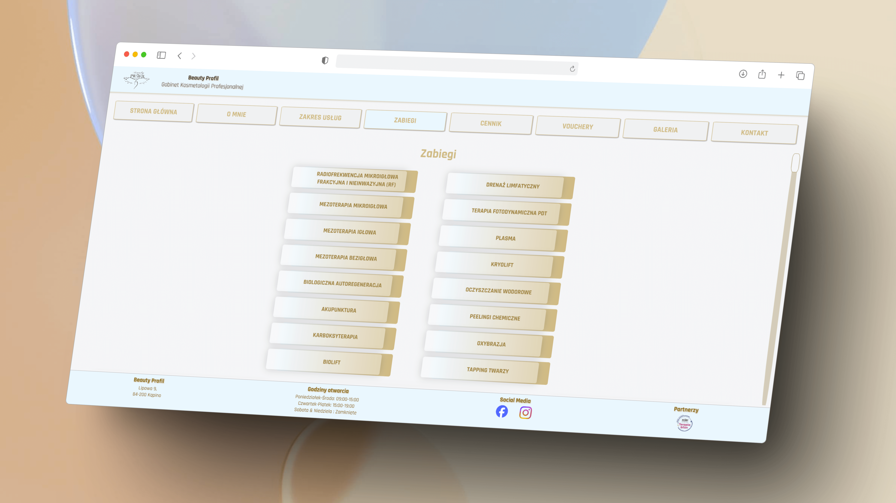
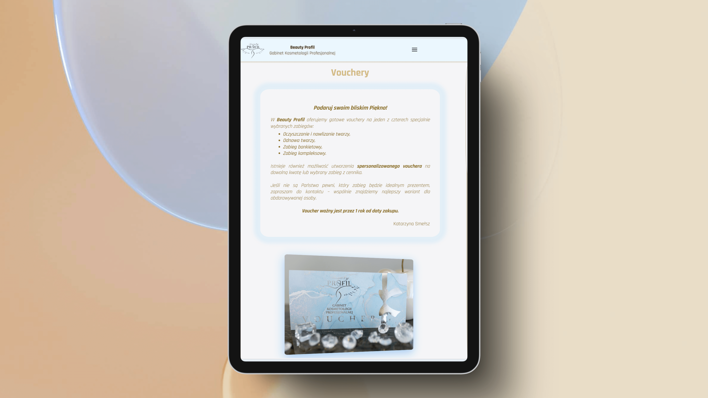

# "Beauty Profil"

**"Beauty Profil"** is the official website of the _Beauty Profil_ beauty salon,
located in Kąpino, northern Poland. By visiting the website,
you can explore the salon’s offerings, easily find directions,
and learn more about its founder, Katarzyna Smełsz.

- The website is **fully responsive** and optimized for all mobile devices.

- The website's **design** is tailored not only to the specifics of the salon's activities but also **reflects the personality of its owner**. Warm, subdued colors, rounded shapes and soft animation transitions perfectly capture the warmth, empathy, elegance, and modesty of Katarzyna Smełsz.

- The website's **design and development** were done by Sara Anastazja Osiecka.

- Due to the commercial nature of the project, **the source code is in a private repository**.

- The website launch is scheduled for **February/March 2025**.

## See "Beauty Profil" In Action

### Home Page

On the "Home page" of the website, you will be greeted by the _Beauty Profil_ logo with outspread angel wings. Below it, in the form of interactive buttons,
you will find links to all the issues that Katarzyna Smełsz
can help you solve,
symbolically taking you under her professional wings.
<br>
<br>
**Device:** <br>
Here you can see how the website looks on a desktop and a **13-inch MacBook Air laptop**.
<br>


Below, with a hopeful smile, Katarzyna Smełsz warmly invites you into her world of professional cosmetology.
<br>

**Device:** <br>
Here you can see how the website looks on an **LG Optimus mobile phone**.


<br>

On the "Home page", there is also a dynamic carousel that,
on subsequent slides, presents the content of subpages and invites you to visit them. Simply click on a slide, and the carousel will take you to the selected section of the website.
<br>
<br>
**Device:** <br>
Here you can see how the website looks on a desktop and a **16-inch MacBook Pro laptop**.
<br>


On the "Home page", there is also a section dedicated to _EstGen scar therapy_, for which _Beauty Profil_ is a partner clinic.

**Device:** <br>
Here you can see how the website looks on a **Nexus 7 tablet**.
<br>


### About Me

On the "About Me" subpage, you can get to know Katarzyna Smełsz, the founder of _Beauty Profil_ and a professional cosmetologist.
<br>
<br> **Device:** <br>
Here you can see how the website looks in the **Safari web browser on a desktop**.
<br>


On this subpage, you can also read authentic customer reviews, each with a link to Google and Facebook for verification.
<br>
<br> **Device:** <br>
Here you can see how the website looks on an **iPad Pro tablet**.
<br>


### Services

On the "Services" subpage, you will learn more about all the problems you can solve at _Beauty Profil_. This is where interactive buttons from the wings on the "Home page" will redirect you.
<br>
<br> **Device:** <br>
Here you can see how the website looks on a desktop with the **Pro Display XDR monitor**.
<br>


### Treatments

On the 'Treatments' subpage, you will find the full range of services offered at the _Beauty Profil_ salon. You will learn about the details of individual cosmetic procedures and discover the results you can expect after a series of selected treatments.
<br>
<br> **Device:** <br>
Here you can see how the website looks in the **Safari web browser on a desktop**.



The subpage features descriptions of 16 treatments and is quite extensive. To make navigation easier for users, the buttons at the top of the suppage redirect them directly to the description of the selected treatment, while the sticky button in the lower right corner allows them to return to the starting point at any time. Thanks to this solution, users won't get lost or discouraged after reading for a longer time.
<br> <br> **Device:** <br>
Here you can see how the page looks on an **iPad Air tablet**.


### Price List

On the "Price List" subpage, you can view the current prices at the _Beauty Profil_ salon, plan your budget, and find out which treatments can be purchased in a package.

<br> **Device:** <br>
Here you can see how the website looks on a **mobile phone**, specifically an **iPhone 14**.


### Vouchers

On the "Vouchers" subpage, you can explore _Beauty Profil_ salon's gift options and select a treatment for a loved one.
<br>
<br> **Device:** <br>
Here you can see how the website looks on an **iPad Mini tablet**.


<br> **Device:** <br>
Here you can see how the website looks on a **mobile phone**, specifically **Samsung Galaxy S8+**.


### Gallery

In the "Gallery", divided into six sections — corresponding to the topics under the angel's wings on the "home page" — you will discover the results of treatments performed at _Beauty Profil_.
<br>
<br> **Device:** <br>
Here you can see how the website looks in the **Safari web browser on a desktop**.


Thanks to interactive buttons, you can select the photo section that interests you the most and then return to the top of the subpage using the sticky button located in the lower right corner of the website.
<br> <br> **Device:** <br>
Here you can see how the website looks on an **iPad Mini tablet**.


All images in the "Gallery" have been optimized for a responsive website using lossless compression.
Thanks to this, you can enlarge them and view them in the highest quality without putting a strain on your device.

### Contact

Finally, on the "Contact" subpage, you will find directions to the _Beauty Profil_ salon via Google Maps, as well as its address, opening hours, contact details, and links to social media.
<br>
<br> **Device:** <br>
Here you can see how the website looks in the **Chrome web browser on a desktop**.


<br> **Device:** <br>
Here you can see how the website looks on a **Surface Pro 7 laptop**.


You can also explore the interior of the salon through a
smoothly scrolling carousel.
<br>
<br> **Device:** <br>
Here you can see how the website looks on a desktop using an **iMac Pro**.


## Technology Stack

- HTML
- CSS
- Sass
- JavaScript
- React
- React Hooks
- React Router
- Vite.js
- Node.js

## Run Project On Local Environment

If you want to use this project on your local environment you have to go throught the following steps:

1.  Clone repository

2.  Install node.js v18.12.1

3.  Make sure your npm version is 9.3.1

4.  In root directory run following commands:

```
npm install
```

Configuration ensures that _Beauty Profil_ website will be automatically open in chrome browser after running below command:

```
npm run dev
```

The website will be served on localhost on port 5173.
